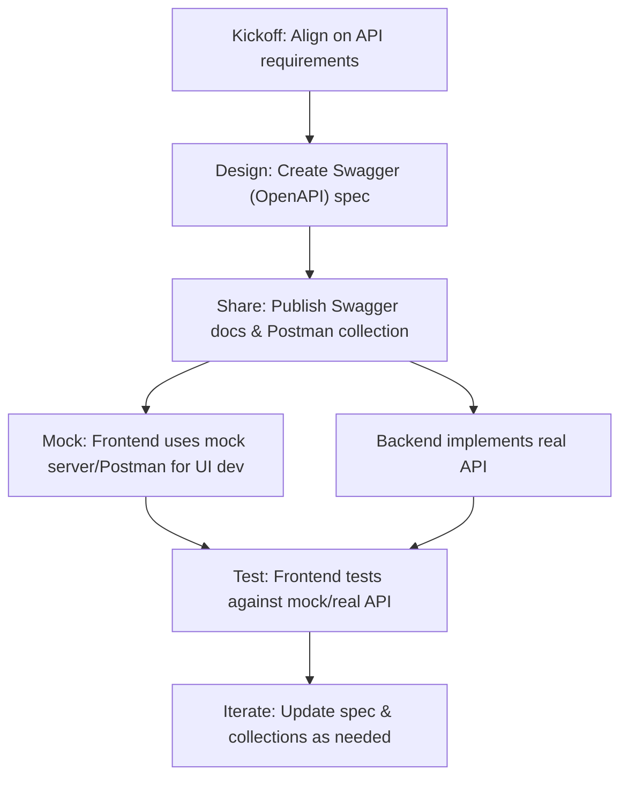

# Qred Backend Developer Case Study – Task 1 Presentation

## API-First Collaboration Workflow



## Swagger/OpenAPI Spec

### GET /api/mobile-view/company-card
```json
{
  "companyName": "Company AB",
  "cardArtUrl": "https://via.placeholder.com/150",
  "isCardActive": true,
  "hasSupportContact": true
}
```

### GET /api/mobile-view/credit
```json
{
  "availableCredit": {
    "used": 5400,
    "limit": 10000,
    "currency": "kr"
  },
  "hasInvoiceDue": true
}
```

### GET /api/mobile-view/transactions?page=1&limit=3
```json
{
  "transactions": [
    { "data": "Transaction data", "points": "Data points", "created_at": "2024-07-03T12:00:00Z", "amount": 2000 },
    { "data": "Transaction data", "points": "Data points", "created_at": "2024-07-02T12:00:00Z", "amount": 1800 }
  ],
  "total": 57,
  "page": 1,
  "limit": 3,
  "hasMore": true,
  "remainingCount": 54
}
```